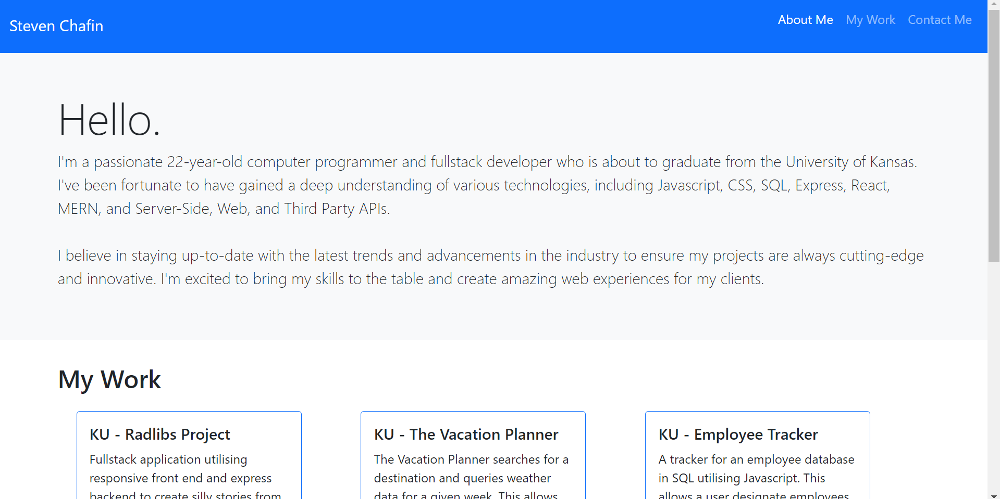

# Portfolio
This is a web development portfolio showcasing the skills and projects of the developer, Steven Chafin.

## Features
- Responsive layout that adjusts to different screen sizes
- Navigation bar with links to different sections of the portfolio
- Sections for about, skills, projects, and contact information
- Projects section with cards displaying project titles, descriptions, and links to GitHub repositories
- Contact section with email address. 
- Footer with links to media accounts such as github. 

## Product View 

## Technologies Used
- HTML
- CSS
- Bootstrap 5

## How to Use
1. Open the [Portfolio](https://schafiniii.github.io/portfolio/) in your web browser. 
2. Navigate the different sections of the portfolio using the navigation bar. 

## Credits
This project was developed by Steven Chafin.

## License 
Licensed under the [MIT](https://opensource.org/licenses/MIT) license.